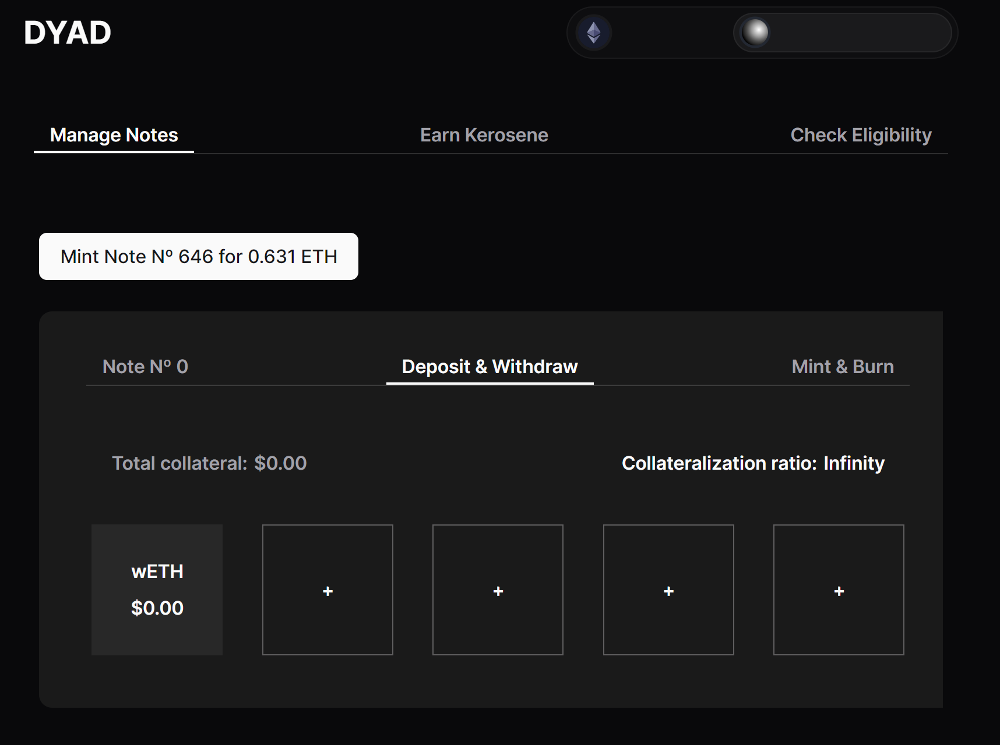
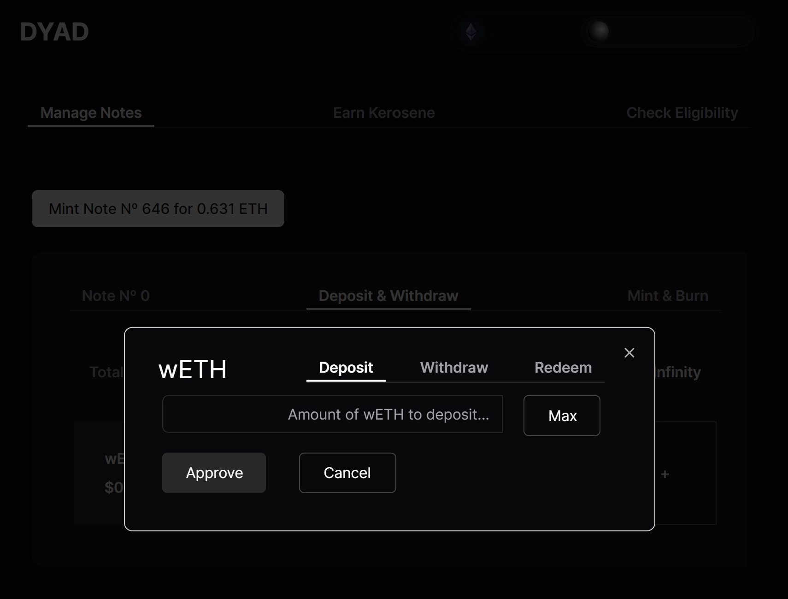

# Depositing Collateral

* At [https://app.dyadstable.xyz/](https://app.dyadstable.xyz/), Note owners can deposit collateral after connecting their wallet, navigating to the 'Deposit & Withdraw' tab and selecting their preferred collateral type (up to 5 different collateral types at one time per Note).&#x20;

<figure><figcaption></figcaption></figure>

* In case no collateral was previously added, click on one of the empty fields to add one of the supported collateral types to your note.

<figure><figcaption></figcaption></figure>

* After adding a collateral type to your note, you can proceed to deposit collateral. Click Approve to review & confirm the transaction in your wallet.

<figure><figcaption></figcaption></figure>
