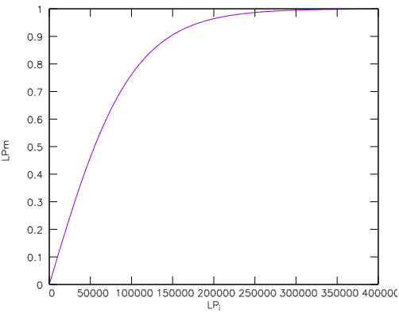

# Rewards

#### Introduction

We reward users that provide liquidity to one of our whitelisted liquidity pools (LP) with Kerosene rewards. Those rewards should end up in the hands of participants that bring value to the growth of our ecosystem. Hence we use two different metrics in order to calculate an effective LP size that is used to calculate the amount of rewards each user is supposed to obtain:

* XP
* LP size

We use hyperbolic tangent functions to create curves for the two metrics, which allows us to define the exact shape of each function - especially the ranges for each metric. This gives us the freedom to put higher weights on the XP metric compared to the LP metric.

#### XP multiplier

$$
XP^m_i = 0.5 + 7.5 \times tanh \left( \frac{XP_i}{XP_{avg.}} \right)
$$

The baseline of this multiplier is $$0.5$$, meaning that a Note without XP is obtaining this multiplier. We use a baseline in order to enable Notes the farming of Kerosene even if they start farming without XP. The average XP ($$XP_{avg.}$$) is used as scaling parameter within the hyperbolic tangent. Users XP is given by $$XP_i$$.

Below is a plot of this multiplier where we fix $$XP_{avg.}=100000$$:

<figure><figcaption>
XPm multiplier as obtained by the hyperbolic tangent.
</figcaption></figure>

#### LP multiplier

$$
LP^m_i = tanh \left(  \frac{LP_i}{max(LP_{min}, LP_{med.})} \right)
$$

The LP multiplier has no baseline and acts as activator of the XP multiplier. The scaling within the hyperbolic tangent is performed differently compared to the XP multiplier. Here, we use the maximum function that chooses either the minimum LP size ($$LP_{min.}=100000$$) or the $$50^{\text{th.}}$$ percentile of the LP size distribution (median LP size, $$LP_{med.}$$). We use $$LP_{med.}$$ in order to prevent attacks from whales that could manipulate the average LP size by providing huge amounts of liquidity to one or more of our liquidity pools. To prevent sybil attacks (e.g., staking many small positions into our staking contract to lower $$LP_{med.}$$), we use a minimum LP size ($$LP_{min.}$$) and the maximum function between $$LP_{min.}$$ and $$LP_{med.}$$. Hence, all user LP sizes are either scaled by $$LP_{min.}$$ or $$LP_{med.}$$ depending on which of both is larger. Users LP is given by $$LP_i$$.

Below is a plot of this multiplier where we fix $$max(LP_{min.}, LP_{med.})=100000$$:

<figure><figcaption>
LPm multiplier as obtained by the hyperbolic tangent.
</figcaption></figure>

#### Effective LP size

Finally, we use both multiplier to calculate the effective user LP size ($$LP^e_i$$):

$$
LP^{e}_i = XP^m_i \times LP^m_i = \left( 0.5 + 7.5 \times tanh \left( \frac{XP_i}{XP_{avg.}} \right) \right) \times tanh \left(  \frac{LP_i}{max(LP_{min}, LP_{med.})} \right)
$$

Our off-chain staking logic uses a user's ($$i$$) effective LP sizes to determine their share ($$s_i$$)

$$
s_i = \frac{LP^e_i}{\sum\limits_i^n LP^b_i}
$$

In the equation above, we have $$n$$ participants that are actively staking their LP tokens.

